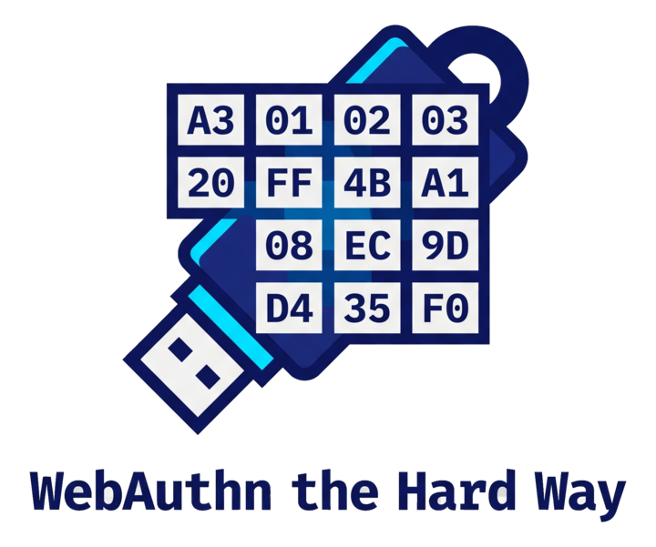

# WebAuthn the Hard Way

[English](README.md) | **日本語**

[](https://github.com/0-draft/webauthn-the-hard-way/actions/workflows/ci.yml)

WebAuthn の Relying Party をゼロから組む。`py_webauthn` も `fido2` も SimpleWebAuthn も使わない。CBOR、COSE、attestation のパース、署名検証、全部手で書く。

これは「Kubernetes the Hard Way」の WebAuthn / Passkey スタック版にあたる教材だ。目的は本番運用できる RP ではない。バイト列のレイアウト、セレモニーのステートマシン、検証ロジックを「見える化」することが目的。

## 作るもの

`localhost:5000` で動く Flask の Relying Party。やることは:

1. `navigator.credentials.create()` で credential を登録する。
2. `attestationObject`（CBOR）を手でパースする。
3. `authenticatorData` のバイトレイアウトを手でパースする。
4. `COSE_Key` を ECDSA P-256（または RSA）公開鍵に手でデコードする。
5. `packed` attestation の署名を検証する。レガシーな CTAP1 authenticator（YubiKey 4 / NEO）向けに `fido-u2f` もサポート。
6. `navigator.credentials.get()` で認証し、assertion の署名を検証する。

外部依存は `flask`（HTTP サーバ）と `cryptography`（実際の ECDSA / RSA プリミティブ）だけ。WebAuthn 固有の処理はすべてローカルコード。

## なぜ "the hard way" なのか

既存のチュートリアルは `py_webauthn.verify_registration_response()` を渡してそれで終わり。そこでは次が飛ばされている:

- **CBOR**: RFC 8949 のワイヤフォーマット。major type、additional info ビット、なぜ `0xa3` が「3 ペアの map」を意味するのか。
- **COSE**: RFC 8152 の鍵エンコーディング。なぜ `{1: 2, 3: -7, -1: 1, -2: <x>, -3: <y>}` が ECDSA P-256 公開鍵なのか。
- **authData レイアウト**: 最小 37 バイト、その先は可変。`rpIdHash (32) | flags (1) | signCount (4) | [AAGUID (16) | credIdLen (2) | credId | credPublicKey]`。
- **Attestation フォーマット**: `none`、`packed`（self vs x5c）、`fido-u2f`、`tpm`、`apple`。それぞれが上に乗る別のサブプロトコル。
- **署名対象（signature base）**: `authenticatorData || SHA256(clientDataJSON)`。連結（concatenation）が効いてくる。バグの多くはここに住む。

仕様（[WebAuthn L3](https://www.w3.org/TR/webauthn-3/)）を読んでバイト列を歩く。絵が頭に定着する唯一の方法はこれだけだ。

## リポジトリ構成

```text
.
├── README.md
├── run.sh                       # venv + flask 起動、localhost を開く
├── pyproject.toml               # deps: flask, cryptography
├── server/
│   ├── app.py                   # Flask RP: /register/{begin,complete}, /authenticate/{begin,complete}
│   ├── cbor.py                  # RFC 8949 デコーダ（サブセット）。依存ゼロ。
│   ├── cose.py                  # RFC 8152 COSE_Key -> cryptography 公開鍵
│   ├── parsers.py               # clientDataJSON, authenticatorData, attestationObject
│   ├── verify.py                # WebAuthn L3 §7.1（登録）と §7.2（認証）
│   └── attestation/
│       ├── __init__.py
│       ├── none.py              # fmt="none"
│       ├── packed.py            # fmt="packed" self + x5c
│       └── fido_u2f.py          # fmt="fido-u2f"（レガシー CTAP1）
├── client/
│   ├── index.html               # 登録 + 認証 UI
│   ├── register.js              # navigator.credentials.create()
│   └── authenticate.js          # navigator.credentials.get()
└── tests/
    ├── test_cbor.py             # RFC 8949 Appendix A テストベクタ
    └── test_cose.py             # COSE_Key ラウンドトリップ
```

## クイックスタート

```bash
./run.sh
# Chrome / Safari / Firefox で http://localhost:5000 を開く
# "Register" をクリック -> Touch ID / Windows Hello / YubiKey
# "Authenticate" をクリック -> 同じ authenticator
```

ターミナルにパース済みの `authData` がフィールドごとに、デコード済みの COSE 鍵、検証結果が表示される。それがこのリポの肝。

## 読む順番

ただ動かすのではなく学びたいなら:

1. `server/cbor.py`（RFC 8949）。ここから始める。CBOR が土台。
2. `tests/test_cbor.py`（RFC 8949 Appendix A）。デコーダが仕様のテストベクタと一致することを確認する。
3. `server/cose.py`（RFC 8152）。COSE = CBOR + 鍵の取り決め。
4. `server/parsers.py`。バイトの抜き出し。多くのチュートリアルが飛ばす層。
5. `server/attestation/packed.py`。検証する署名は `authData || clientDataHash` に対するもの。連結が効いてくる。
6. `server/verify.py`。19 ステップの登録手順と 22 ステップの認証手順を、そのまま書き下したもの。

## 制限（意図的なもの）

- credential ストアはインメモリ。データベースなし。
- Attestation: `none` + `packed` + `fido-u2f`。`tpm`、`android-key`、`android-safetynet`、`apple` は省略。（面白いが追加要素にすぎず、コアのセレモニーは同一。）
- アルゴリズム: ES256（`-7`）+ RS256（`-257`）。EdDSA / RS1 はなし。
- メタデータサービス（FIDO MDS）連携なし。AAGUID はパースするが照合はしない。
- localhost 限定。WebAuthn は localhost 以外の RP ID では HTTPS が必須だが、仕様は `localhost` を唯一の例外として切り出している。これでデモが依存ゼロを保てる。

## 参考文献

- [W3C WebAuthn Level 3](https://www.w3.org/TR/webauthn-3/)
- [RFC 8949: CBOR](https://www.rfc-editor.org/rfc/rfc8949)
- [RFC 8152: COSE](https://www.rfc-editor.org/rfc/rfc8152)
- [RFC 9052: COSE (revised)](https://www.rfc-editor.org/rfc/rfc9052)
- [FIDO Alliance: Passkey](https://fidoalliance.org/passkeys/)

## ライセンス

MIT。
